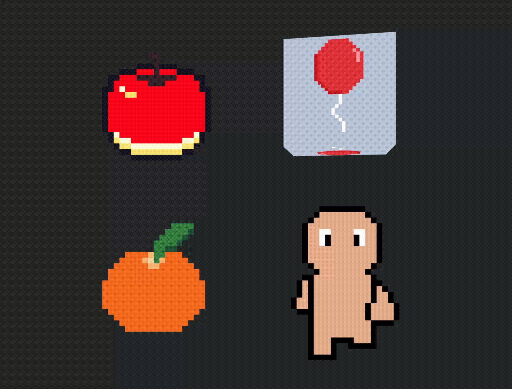

# Bevy Pixquare Ultra

[](https://github.com/kudohamu/bevy_pixquare_ultra/actions/workflows/ci.yaml)

The ultimate bevy pixquare plugin. This plugin allows you to load and render artwork data of [Pixquare](https://www.pixquare.art/).  
[Pixquare](https://www.pixquare.art/) is the awesome and feature-rich pixel art editor.  
And this is heavily inspired by [bevy_aseprite_ultra](https://github.com/Lommix/bevy_aseprite_ultra).

<div align="center">
  
</div>

## Features

- Play animations using the frame durations and tags stored in Pixquare artwork.
- Render artwork in Sprite, UI, 2D Materials, and custom render targets.
- Render a named region of an artwork as a texture atlas sprite.
- Advance, pause, restart, and observe animations from your game logic.

## Getting started

```toml
# Cargo.toml
[dependencies]
bevy_pixquare_ultra = "0.1.0"
```

The following is a minimal example.

```rust,no_run
use bevy::{image::ImageSamplerDescriptor, prelude::*};
use bevy_pixquare_ultra::prelude::{PixquareFile, PixquareUltraPlugin};

fn main() {
  App::new()
    .add_plugins(DefaultPlugins.set(ImagePlugin {
      default_sampler: ImageSamplerDescriptor::nearest(),
    }))
    .add_plugins(PixquareUltraPlugin)
    .add_systems(Startup, setup)
    .run();
}

fn setup(mut commands: Commands, assets: Res<AssetServer>) {
  commands.spawn(Camera2d);
  commands.spawn((
    PixquareFile {
      artwork: assets.load("sample.px"),
      ..default()
    },
    Sprite::default(),
  ));
}
```

## Optional features

| feature | description |
| :-- | :-- |
| `asset_processing` | Integrate with Bevy's asset processing pipeline. Preprocess .px files into a runtime-ready format containing minimal composited frame images and animation metadata. Therefore, you do not need to bundle the original artwork binaries in your build artifacts. See [the example](./examples/asset_processing.rs). |
| `3d` | Enable integration with Bevy 3D materials. See [the example](./examples/material3d.rs). |
| `atlas_asset` | Load named atlas regions from a .pxatlas.ron file. See [the example](./examples/texture_atlas_from_asset.rs). |

## Examples

| example | description |
| :-- | :-- |
| [Animation](./examples/animation.rs) | example using PxFrameAnimation component. |
| [Animation Duration](./examples/animation_duration.rs) | example of overriding the frame duration. |
| [Asset Processing](./examples/asset_processing.rs) | example of using bevy's asset processing pipeline. |
| [Manual](./examples/manual.rs) | example of manually advancing frame animations. |
| [Material 2d](./examples/material2d.rs) | example of rendering px image to 2d material. |
| [Material 3d](./examples/material3d.rs) | example of rendering px image to 3d material. |
| [Observe Animation Finished Events](./examples/observe_animation_finished_events.rs) | example observing animation finished events of PxFrameAnimation component. |
| [Restart Animation Manually](./examples/restart_animation_manually.rs) | example of manually restarting animation. |
| [Simple](./examples/simple.rs) | minimal example of `bevy_pixquare_ultra`. |
| [Tag](./examples/tag.rs) | example of specifying the frame to render by tag. |
| [Tag Animation](./examples/tag_animation.rs) | example of animating with a specified tag. |
| [Texture Atlas](./examples/texture_atlas.rs) | example of rendering only a specific region of image using a texture atlas. |
| [Texture Atlas From Asset](./examples/texture_atlas_from_asset.rs) | example of rendering only a specific region of image using a texture atlas. |
| [Texture_Slice](./examples/texture_slice.rs) | example of implementing nine-patch scaling using texture_slice. |
| [UI](./examples/ui.rs) | example of rendering to ui node. |

## Compatible Bevy versions

| Bevy version | `bevy_pixquare_ultra` version |
| :-- | :-- |
| 0.19 | 0.2 |
| 0.18 | 0.1 |
